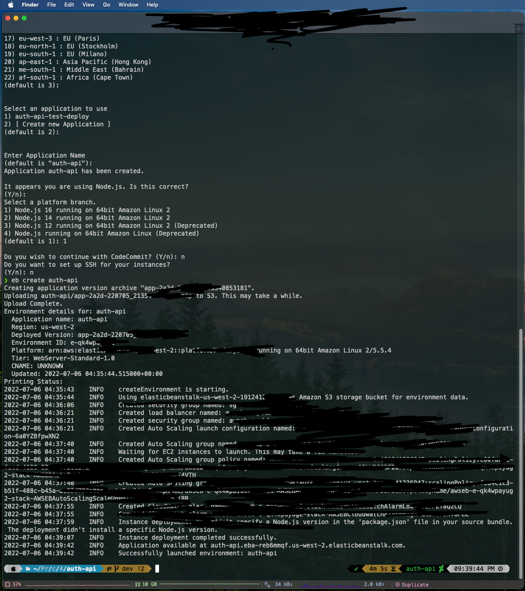
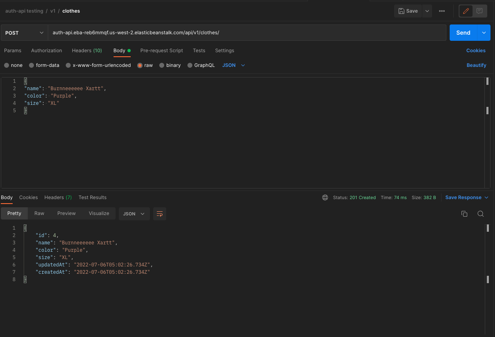
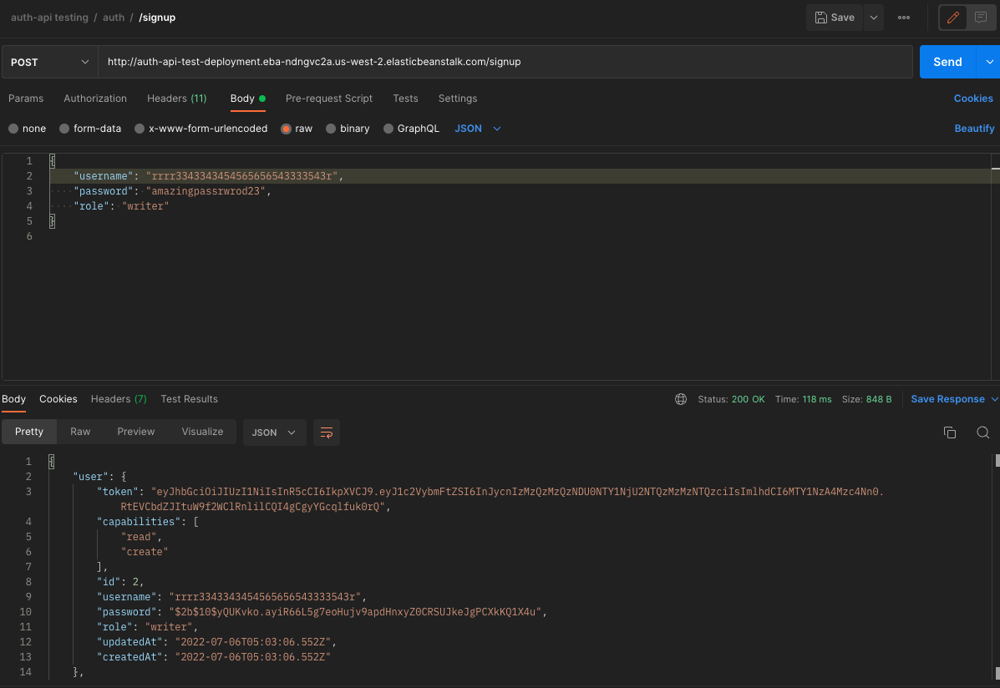
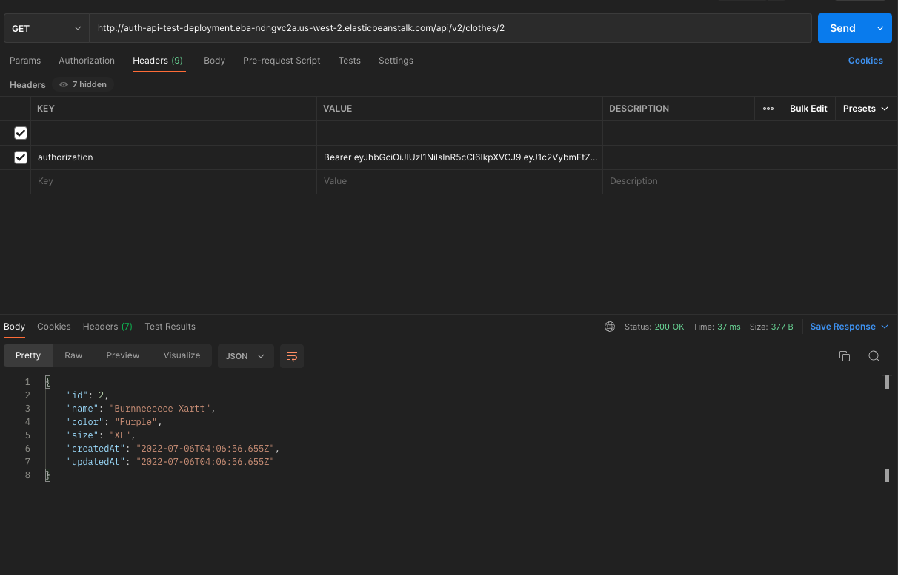

# cloud-server

## Deployments

[AWS GUI Deployment](http://auth-api-test-deployment.eba-ndngvc2a.us-west-2.elasticbeanstalk.com/)

[AWS CLI Deployment](http://auth-api.eba-reb6mmqf.us-west-2.elasticbeanstalk.com/)

(Visiting base url above will only result in a 404)

## Author

- Dylan Ullrich

## Process

AWS deployment on GUI is easy, but CLI is sweet and straight to the point. After utilizing the GUI, the CLI felt like a breeze.

### Using Terminal

### Checking Routes with Postman

**POST without Auth**

**Signup**

**GET with Auth**

